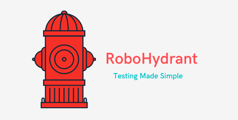

# SCDFLyfsavers
SCDF X IBM Lifesavers' Innovation Challenge 20/21 

  

  

    "RoboHydrant - A fully integrated IoT system for hydrant testing"
     
     
    <a href="https://scdf-lyfsavers.s3-web.jp-tok.cloud-object-storage.appdomain.cloud/">Website Demo</a>
    ·
    <a href="https://www.youtube.com/watch?v=JNbpxYbvVJQ">Video Demo</a>
  

# Who are we?
 
Team Lyfsavers comprises of Jethro, Xin Rui, Riyan, You Sheng and Brandon. Though we are taking different courses in Nanyang Technological University, we have come together, each with our own unique skillsets, to tackle the this year SCDF X IBM Lifesavers' Innovation Challenge.

# Problem Statement Chosen

How might we leverage emerging technologies (specifically "Green-Tech") to enhance emergency response and public safety in Singapore and make SCDF's service delivery environmentally friendly by design?

# Short Description

RoboHydrant - A fully integrated IoT system for hydrant testing that aims to test the static pressure of the hydrant remotely. This will allow:

- SCDF to engage in more efficient resource allocation and scheduling which will greatly improve SCDF operational readiness 
- Precious water that are wasted away during the course of traditional hydrant testing methods to be saved  
- Eliminate water Damage to the nearby surroundings
- Fuel expanded for these adhoc duties to be saved

# Whats the problem?

Our team members, Jethro and Riyan were stationed at Central Fire Station as section commanders during their NS and the problems listed below are raised up based on their personal experience.

## Reduced Operational Readiness
Every month, each fire station will be tasked with the ad-hoc duty of routine testing of fire hydrants during non-emergency times around Singapore to ensure that the water pressure is at an acceptable pressure for firefighting operations. However, for such traditional hydrant testing methods, it is standard procedure for SCDF to off-run a firefighting vehicle (either a LF or NCO) to conduct such testing that might take up to 2-3 hours. As such, this might cripple the station's firefighting force.

## Not environmentally friendly
Traditional hydrant testing requires tests for both static and flow pressure of the water. While testing for static pressure is hassle-free, testing for the flow rate and dynamic pressure of water is not. SCDF personnel have to turn on the valve and have the water gush out of the hydrant to test for these. This is hazardous for the environment and it is a clear waste of water. With the high dynamic pressure and flow rate, water damage might be incurred on the surroundings. Last but not the least, alot of fuel is also expanded during such ad hoc duties. 

# How can technology help? 

By utilising pressure sensors in conjuction with a software app, we are able to design a fully integrated IoT system, RoboHydrant, that allows fire stations to conduct hydrant testing remotely without having to off-run an appliance. This will enhance each station's operational readiness. At the same time, as our solution tests for static pressure as a preliminary test for a hydrant, we can minimise environmental cost incurred only to instances where dynamic testing is required. Furthermore, with such automation comes increased accuracy, efficiency and reliability in collecting data for hydrants around Singapore.

# The idea

RoboHydrant is an IoT system which utilises IBM CloudFoundry for effective relaying of information between SCDF personnel and the SKU SEN0257 barometric pressure sensor that will be installed in each fire hydrant.

More often than not, SCDF personnel choose to first test the static pressure of the hydrant as the first line of defence before determining whether there is a need to test for the flow pressure of the hydrant. As such, our solution consist of a mobile app which can be used to remotely control the SKU SEN0257 pressure sensor in a specified hydrant to test its static pressure results. The app is also able to store and display all historical records of any fire hydrants within 10km radius around the station for reference.

These essential information will be clearly displayed as a dashboard on our app for SCDF personnel. On the account that the static pressure is lower than expected (below 20psi), it will send a notification to the user to warn him/her of the low pressure to prompt them to then physically go down for a check.

# The architecture of your proposed solution

## SCDF Personel
1. Each station will be given 2 accounts to login via the mobile app.
2. Appointed Hydrant ICs shall log in base on the account that is given to them. 
3. During the allocated time slots for hydrant testing, appointed hydrant IC's will turn on the valve from the mobile app. 
4. The mobile app will send a http request to the sensor to then turn on the valve of the hydrant and activate the SKU SEN0257 pressure sensor. The sensor will then send the http request to the IBM cloud.
5. The mobile app will then retrieve its information from the IBM cloud and process the information before displaying it on the dashboard in the app. A warning notification might be sent if the static pressure is below the targeted 20psi, else it will show a green tick. 

# Detailed description

[More details available here](https://github.com/JethroPhuah/SCDFLyfsavers/tree/main/Detailed%20Description)

# Proposed Roadmap/Timeline

# Getting started / Usage Guide

Currently, our team is still working to develop the working apk, however a demo of the mobile application can be found at: https://scdf-lyfsavers.s3-web.jp-tok.cloud-object-storage.appdomain.cloud/index.html

The app dashboard is real-time, and will display real-time static pressure readings made by the responders. 

- Step 1 - As a responder, log in to the app with the allocated username and password.

- Step 2 - Select the hydrant you want to test. (Not implemented in the above demo yet)

- Step 3 - Toggle the on and off button to turn on the valve to obtain the readings from the SKU SEN0257 pressure sensor installed in them.

**Please do note that we have bypassed the user authentication and all values displayed on the mobile app are not the actual collection of data. (FOR DEMO PURPOSES ONLY)

## [Video Pitch](https://www.youtube.com/watch?v=JNbpxYbvVJQ)

# Technologies Used / Built With

Current Prototype:

- [IBM Cloud Foundry](https://www.ibm.com/cloud/cloud-foundry) - Web Server Hosting
- [FastApi](https://fastapi.tiangolo.com/) - Web Application Framework
- [Flutter](https://flutter.dev/) - Mobile App Application Framework

